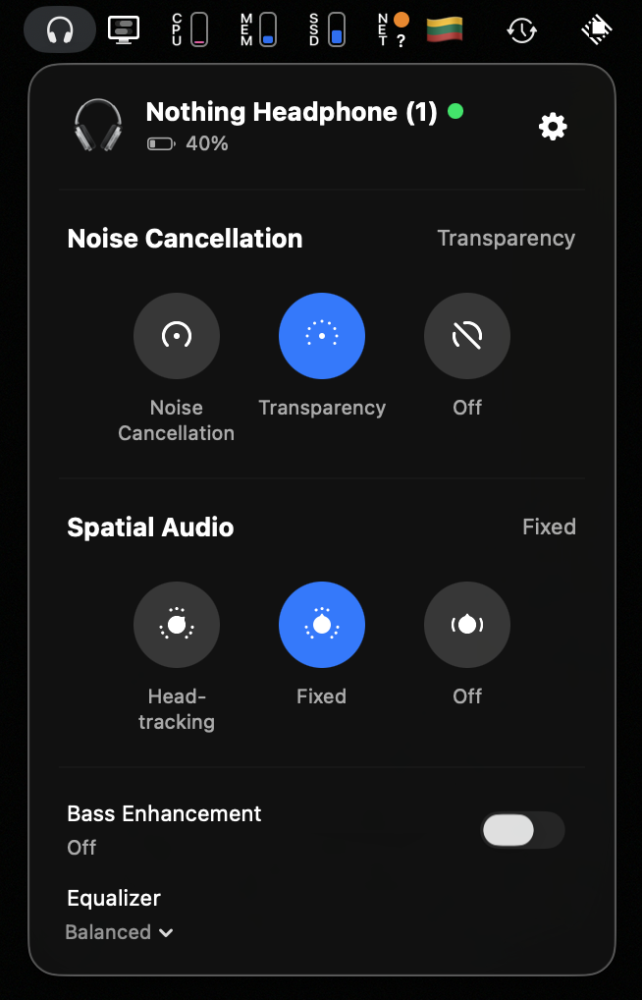
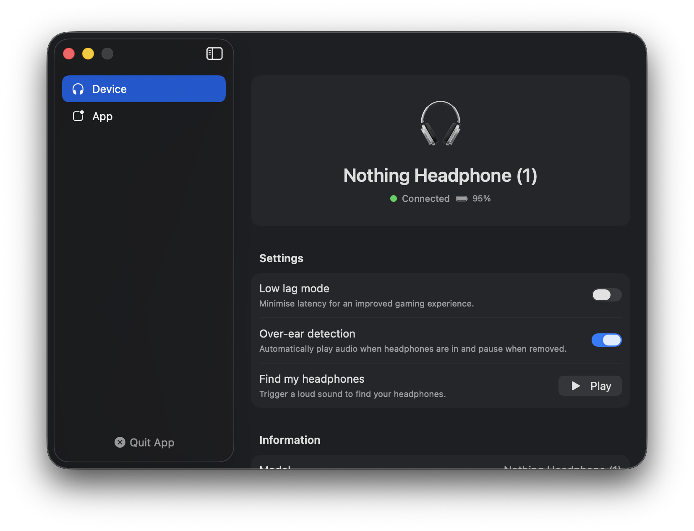
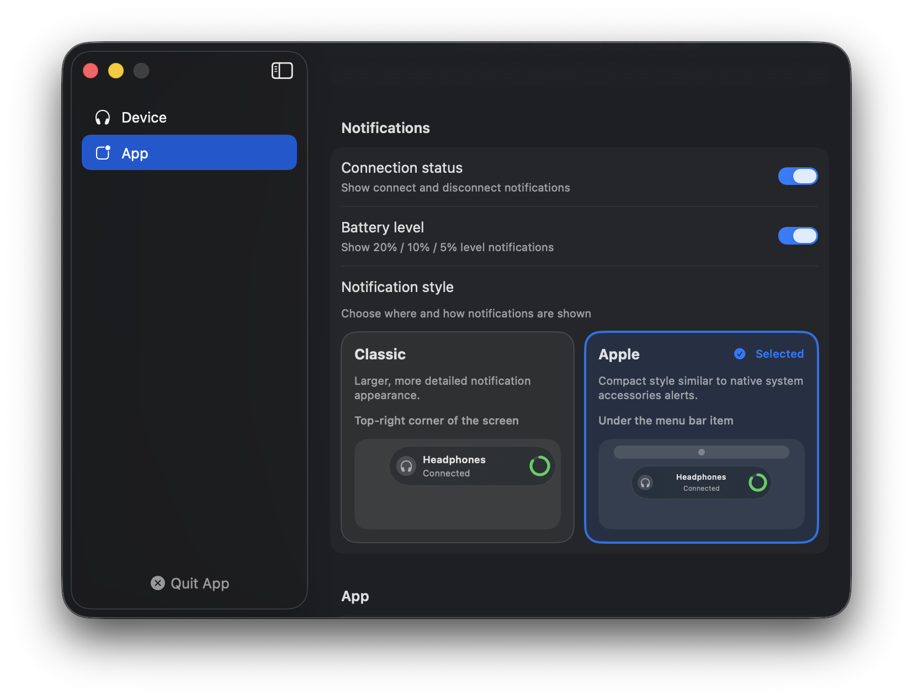
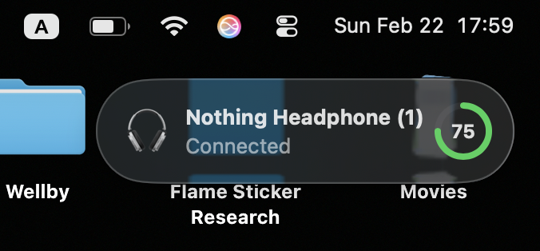
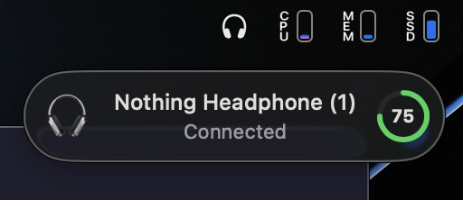

# nothing-bar

> It's unofficial software and not affilated with Nothing ([legal](#legal-disclaimer))

Native macOS menu bar app to control Nothing headphones. Completely local, fully native, no analytics, entirely free. Feel free to contribute.

Special credits to:

> Ear (web) project developers for bluetooth communication code, it has been really helpful in developing this project. Link to Ear (web): https://earweb.bttl.xyz

## Installation

Download .zip archive from [releases](https://github.com/bestK1ngArthur/nothing-bar/releases) and drag `NothingBar.app` to `/Applications` folder. The app updates automatically through the [Sparkle](https://sparkle-project.org/), you can manage this in the app settings.

## Screenshots

### Bar

### Settings

### Notifications

| Classic | Apple |
| --- | --- |
|  |  |

## Supported Devices

- 🟢 _works and tested_
- 🟡 _may work, but support is still in process_

> The library [swift-nothing-ear](https://github.com/bestK1ngArthur/swift-nothing-ear) is used to communicate with the device. New features should first be supported there, and then in the app.

- 🟡 Nothing Ear (1)
- 🟡 Nothing Ear (2)
- 🟡 Nothing Ear (3)
- 🟡 Nothing Ear (stick)
- 🟡 Nothing Ear (open)
- 🟡 Nothing Ear
- 🟢 Nothing Ear (a)
- 🟢 Nothing Headphone (1)
- 🟡 Nothing Headphone (a)
- 🟡 CMF Buds Pro
- 🟢 CMF Buds Pro 2
- 🟡 CMF Buds
- 🟡 CMF Buds 2a
- 🟢 CMF Buds 2
- 🟡 CMF Buds 2 Plus
- 🟡 CMF Neckband Pro
- 🟡 CMF Headphone Pro

> [!TIP]
> If nothing happens when connecting the headphones, please check the **Bluetooth device name**. It's better if it matches the factory name (or a suitable model from the list above). Some models can be automatically detected by serial number, but not all.

## How to Contribute

1. Fork the repository.
2. Implement a new feature, fix a bug, or make any changes you'd like. You can use AI agents or any tools you prefer to help with coding, but please review and test your code manually before submitting.
3. Create a pull request describing what you've done and why it should be merged into the app. I'll review the changes, which may take some time. I may also ask you to make some modifications. In rare cases, I might decline the pull request with an explanation.
4. After merging, once enough changes have accumulated for a release, I'll build an update and make it available to all users.
5. Thank you for your contribution — you're awesome!

> [!NOTE]
> If you want to modify the headphone interaction functionality, you should make those changes in the [swift-nothing-ear](https://github.com/bestK1ngArthur/swift-nothing-ear) package.

If you can't code but have ideas on how to improve the app, please [create an issue](https://github.com/bestK1ngArthur/nothing-bar/issues/new/choose) and describe your idea, bug report, or any other needed change. I'll do my best to implement the necessary functionality in my spare time.

## Future Features

- [x] Auto-update system
- [x] Spatial Audio
- [ ] Installation from brew
- [x] Find buds
- [ ] More EQ capabilities
- [ ] Handle controls gestures

## Legal Disclaimer

1. This software is not affiliated with, sponsored by, or endorsed by Nothing Technology. This software is a third-party project and is NOT an official Nothing product.

2. Nothing, the Nothing logo and other brand related content are trademarks of Nothing Technology Limited and are protected by copyright, trademark, and other intellectual property laws.

3. You use this software at your own risk. The developer makes no warranties regarding compatibility with all firmware versions, performance, or reliability. 

4. The developer shall not be liable for any direct or indirect damages arising from the use of the software, including data loss, hardware damage, or degraded audio quality. 

5. By installing and using this software, you agree to the terms of this disclaimer.

If you have questions, [contact me](mailto:bestk1ngarthur@aol.com).
