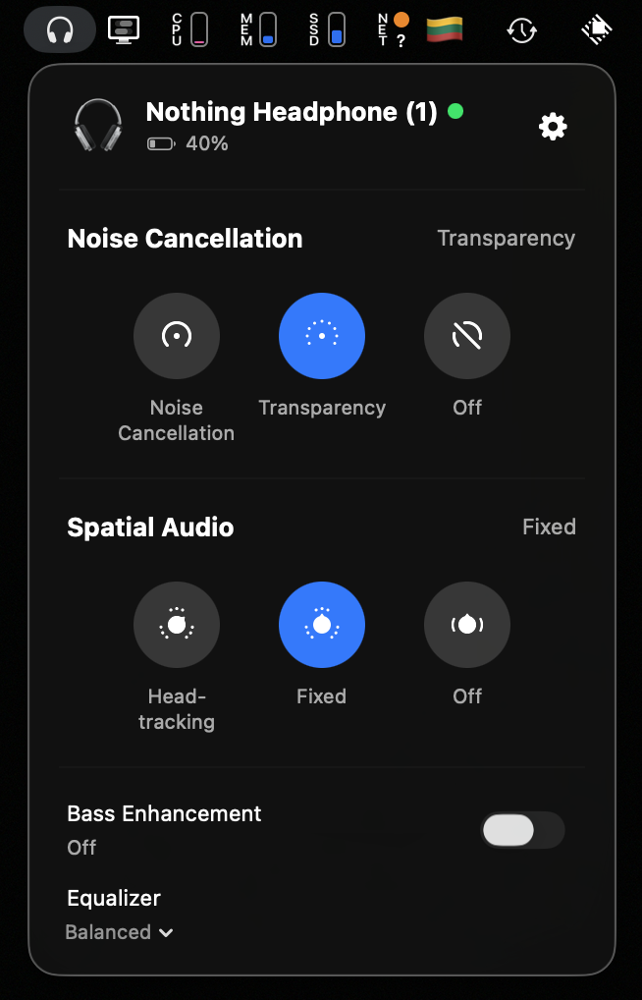

# nothing-bar

> It's unofficial software and not affilated with Nothing ([legal](#legal-disclaimer))

Native macOS menu bar app to control Nothing headphones.

Special credits to:

> Ear (web) project developers for bluetooth communication code, it has been really helpful in developing this project. Link to Ear (web): https://earweb.bttl.xyz

## Installation

Download [DMG installer](https://github.com/bestK1ngArthur/nothing-bar/releases/download/1.0/NothingBar.dmg) from [releases](https://github.com/bestK1ngArthur/nothing-bar/releases) and drag `NothingBar.app` to `/Applications` folder.

## Screenshots

### Bar

### Settings

## Supported Devices

- 🟢 _works and tested_
- 🟡 _may work, but support is still in process_

> The library [swift-nothing-ear](https://github.com/bestK1ngArthur/swift-nothing-ear) is used to communicate with the device. New features should first be supported there, and then in the app.

- 🟡 Nothing Ear (1)
- 🟡 Nothing Ear (2)
- 🟡 Nothing Ear (stick)
- 🟡 Nothing Ear (open)
- 🟡 Nothing Ear
- 🟡 Nothing Ear (a)
- 🟢 Nothing Headphone (1)
- 🟡 CMF Buds Pro
- 🟡 CMF Buds
- 🟡 CMF Buds Pro 2
- 🟡 CMF Neckband Pro

## Legal Disclaimer

1. This software is not affiliated with, sponsored by, or endorsed by Nothing Technology. This software is a third-party project and is NOT an official Nothing product.

2. Nothing, the Nothing logo and other brand related content are trademarks of Nothing Technology Limited and are protected by copyright, trademark, and other intellectual property laws.

3. You use this software at your own risk. The developer makes no warranties regarding compatibility with all firmware versions, performance, or reliability. 

4. The developer shall not be liable for any direct or indirect damages arising from the use of the software, including data loss, hardware damage, or degraded audio quality. 

5. By installing and using this software, you agree to the terms of this disclaimer.

If you have questions, [contact me](mailto:bestk1ngarthur@aol.com).
